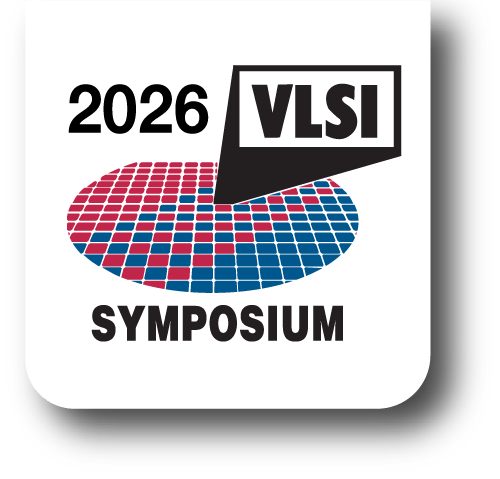

近日，林秋阳博士关于**固态纳米孔测序接口芯片**的最新研究成果被 **VLSI** 录取。

该工作题为 **“A 16-channel 97pArms 1MHz Bandwidth IC for Solid State Nanopore Sequencing”**，
面向下一代**高通量、并行化单分子检测与DNA测序系统**，提出了一种
**16通道全集成纳米孔接口芯片**，实现了高增益、宽带宽、低噪声与高能效的统一。

<!--more-->

该芯片采用 **0.13μm CMOS** 工艺实现，主要性能包括：

- **16通道全并行读出**
- **20MΩ 跨阻增益**
- **1MHz 信号带宽**
- **97pArms 输入等效噪声**
- **1.7mW / 通道功耗**

论文针对固态纳米孔信号“**瞬态快、噪声高、并行读出要求高**”等关键挑战，
提出了结合 **TIA–equalizer 架构、混合反馈电阻以及高能效缓冲与ADC驱动** 的解决方案，
在实现宽带、高增益和低噪声读出的同时，显著提升了系统集成度与能效。

该工作进一步完成了**带标签DNA分子穿孔事件的并行检测验证**，
展示了芯片在**下一代基因组学、单分子传感与高通量生物检测系统**中的应用潜力。

这项成果体现了实验室在以下方向上的持续推进：

- 生物医疗传感接口电路
- 高性能模拟与混合信号集成电路
- 纳米孔测序芯片与系统
- 高通量分子检测电子学

未来，实验室将继续围绕**生物医疗芯片与系统的高性能、高集成与智能化方向**开展研究，
推动从芯片、封装、系统验证到应用落地的完整技术链发展。
