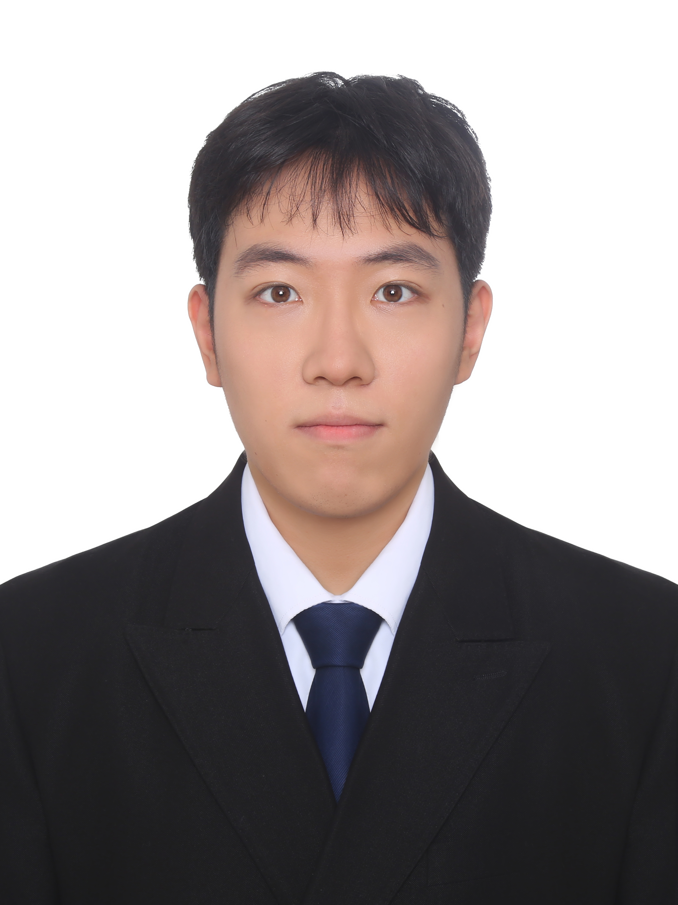

We are pleased to welcome two new students to the lab: **Xinao Ji** and **Yidi Sun**. Both students will continue their studies at Fudan University and join the group to pursue research in integrated circuits and related areas.

<!--more-->

The lab is always happy to welcome outstanding students with strong academic foundations, a passion for research, and a keen interest in biomedical integrated circuits, analog and mixed-signal circuits, and related topics. The arrival of these two new students will further strengthen the vitality and potential of the group in these research areas.

  

    
    
<strong>Xinao Ji</strong> PhD Student (2026–)

    

      Xinao Ji received his B.Eng. degree in <strong>Microelectronics Science and Engineering</strong> from Xi’an Jiaotong University in <strong>2023</strong>. He then continued at Xi’an Jiaotong University as a recommended postgraduate student in <strong>Electronic Science and Technology</strong>, and is expected to receive his M.Eng. degree in <strong>2026</strong>. He will then join Fudan University to pursue a <strong>PhD degree in Integrated Circuit Science and Engineering</strong> in the group.
    

  

  

    
    
<strong>Yidi Sun</strong> Master’s Student (2026–)

    

      Yidi Sun is currently an undergraduate student majoring in <strong>Electronic Science and Technology</strong> at Hunan University, and has been recommended for graduate study in <strong>Electronic and Information Engineering</strong> at Fudan University. Her future research will focus on topics such as <strong>brain–computer interface circuits</strong>. During her undergraduate study, she built a strong academic foundation and received several honors, including the <strong>National Scholarship</strong> and the <strong>Second Prize in the National Finals of the China Integrated Circuit Innovation and Entrepreneurship Competition for College Students</strong>.
    

  

The academic backgrounds of the two students span **electronic science and technology, microelectronics, electronic information, and analog/mixed-signal integrated circuit design**, which align closely with the lab’s current research directions, including:

- Biomedical integrated circuits and systems
- Analog and mixed-signal integrated circuits
- Sensor and neural interface circuits
- Data converters and analog front-end circuits

Looking ahead, the lab will continue to pursue research on **high-performance, highly integrated chips and systems for biomedical and intelligent sensing applications**, and we look forward to growing together with more outstanding students in the years to come.
