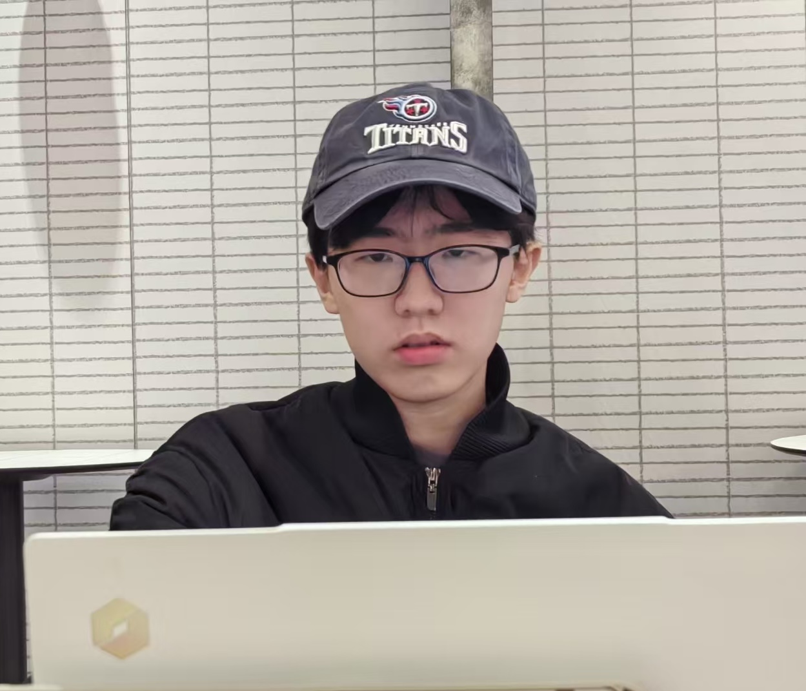

近日，实验室迎来三位新同学：**季心敖同学**、**孙艺迪同学**和**王奕如同学**。三位同学将加入或已经加入课题组参与科研，并将在复旦大学继续深造，围绕生物医疗集成电路、模拟与混合信号集成电路等方向开展学习与研究。

<!--more-->

实验室始终欢迎专业基础扎实、对科研抱有热情，并对生物医疗集成电路、模拟与混合信号电路等方向具有浓厚兴趣的优秀学生加入。三位新同学拥有不同的学习经历和研究基础，他们的加入将为课题组带来新的活力。

## 季心敖

**博士生（2026–）**

季心敖同学于 **2023 年**毕业于西安交通大学微电子科学与工程专业，获得工学学士学位。随后，他通过推免进入西安交通大学电子科学与技术专业攻读硕士学位，并将于 **2026 年**获得工学硕士学位。

同年，他将加入复旦大学，在课题组攻读**集成电路科学与工程专业博士学位**，围绕模拟与混合信号电路、电流转换电路、模数转换器及模拟前端电路等方向开展研究。

---

## 孙艺迪

**硕士生（2026–）**

孙艺迪同学现就读于湖南大学电子科学与技术专业，已推免至复旦大学电子信息专业。在本科阶段，她打下了良好的专业基础，曾获**国家奖学金**、**全国大学生集成电路创新创业大赛全国总决赛二等奖**等荣誉。

加入课题组后，她将围绕**脑机接口电路**等方向开展研究。

---

## 王奕如

**硕士生（2027–）**

王奕如同学本科就读于复旦大学微电子科学与工程专业（2023–2027）。在本科阶段，他系统修读了《模拟集成电路》等专业课程并取得优异成绩，具备扎实的微电子与集成电路专业基础。

他于 **2026 年**加入课题组参与科研项目，后续将在本课题组攻读**集成电路科学与工程专业硕士学位**，重点关注模拟前端电路与生物医疗传感接口等方向。

---

三位同学的专业背景涵盖电子科学与技术、微电子科学与工程、电子信息等领域，与实验室当前的研究方向密切相关：

- 生物医疗集成电路与系统
- 模拟与混合信号集成电路
- 传感器与神经接口电路
- 数据转换器与模拟前端电路
- 生物医疗传感接口与低噪声读出电路

未来，实验室将继续围绕**面向生物医疗与智能感知应用的高性能、高集成度芯片与系统**开展研究。期待三位同学在新的学习阶段中保持好奇、踏实探索，在解决实际问题的过程中不断成长，也为实验室带来新的思考与成果。
