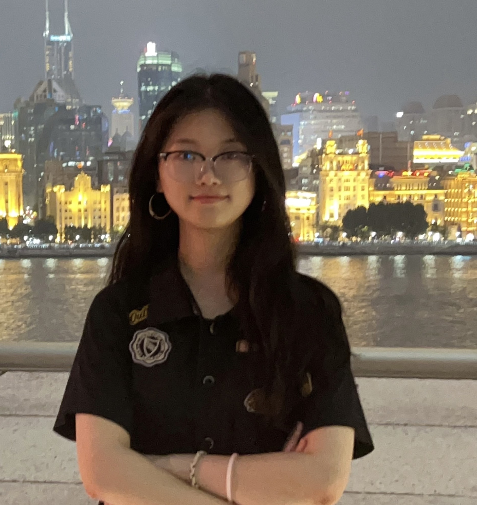

近日，实验室迎来新同学——**袁思怡同学**。她将作为**专项硕士研究生**进入复旦大学芯片与系统前沿技术研究院林秋阳老师课题组学习，并由**复旦大学与华虹公司联合培养**，围绕生物医疗电子与模拟前端集成电路设计等方向开展研究。

<!--more-->

  

  
<strong>袁思怡</strong> 专项硕士生（2026–）

  

    袁思怡同学于 <strong>2026 年</strong>在西安电子科技大学集成电路学部获得工学学士学位。本科期间，她成绩排名前列，专业基础扎实，曾获<strong>国家奖学金</strong>、本科生<strong>“青春人物”</strong>等荣誉，并参与过放大器、可编程增益放大器（PGA）等项目，积累了模拟集成电路设计方面的实践经验。
  

  

    2026 年，袁思怡同学进入复旦大学芯片与系统前沿技术研究院林秋阳老师课题组攻读硕士学位。她是由<strong>复旦大学与华虹公司联合培养的专项硕士研究生</strong>，研究兴趣包括生物医疗电子、模拟前端集成电路以及放大器与可编程增益放大器设计。
  

  

    学习与科研之余，她喜欢户外徒步、游泳和羽毛球，也喜爱阅读文学作品以及认知与思维类书籍。
  

袁思怡同学的加入，将进一步丰富课题组在生物医疗电子与模拟前端集成电路方向的研究力量。未来，她将结合与华虹公司开展的专项项目，围绕相关集成电路技术进行学习与研究，在项目实践中不断提升专业能力。

欢迎袁思怡同学加入课题组，期待她在未来的学习与科研工作中不断探索、稳步成长！
