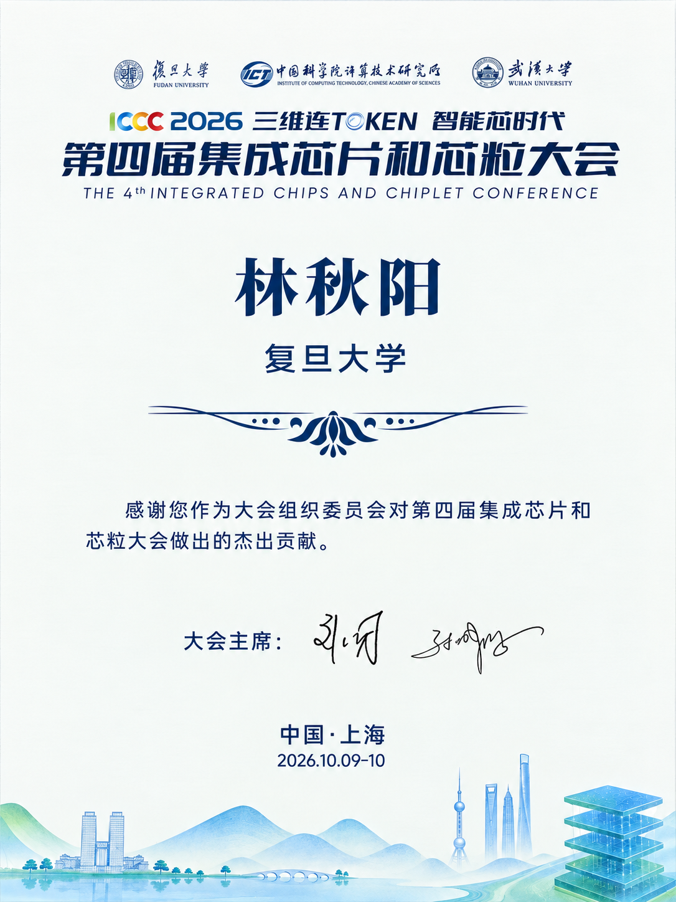

2026 年 10 月 9—10 日，**第四届集成芯片和芯粒大会（ICCC 2026）**在上海举行。实验室同学参加了本次大会，感受学术交流氛围，学习集成芯片与芯粒领域的新知识、新进展。实验室**林秋阳老师**作为大会组织委员会成员参与筹备工作，并收到大会颁发的感谢证书，以肯定其为会议组织作出的贡献。

本届大会由**复旦大学、中国科学院计算技术研究所、武汉大学**共同主办，以**“三维连 Token，智能芯时代”**为主题，围绕三维集成、异构集成与智能化应用等方向展开交流，为来自高校、科研机构和产业界的参会者提供了共同探讨技术问题的机会。

<!--more-->

对同学们而言，走进学术会议，是将课堂知识与前沿研究联系起来的一次学习经历。通过聆听报告、了解不同团队的研究工作，大家对芯粒技术及其相关研究方向有了更直观的认识，也进一步感受到，芯片与系统的进步需要电路设计、工艺、封装和体系结构等多个领域的协同。

对于主要关注生物医疗集成电路与模拟混合信号电路的实验室来说，这样的学习同样具有意义。将视野从具体电路模块拓展到系统集成，有助于我们思考不同功能、不同工艺的芯片如何共同服务于实际应用，也为今后的研究积累新的问题与思路。

会议期间，同学们还一起共进晚餐。在紧凑的参会安排之外，一顿晚饭也留下了轻松的相聚时光，为这次学习之行增添了一份温暖的集体记忆。

本次大会中，**林秋阳老师参与了会议筹备工作**，并收到大会颁发的感谢证书。证书对其作为大会组织委员会成员，为第四届集成芯片和芯粒大会作出的贡献表示感谢。这份肯定也是一份鼓励，激励我们在开展科研工作的同时，继续积极参与学术交流与学术共同体建设。

大会的圆满举行，离不开众多组织者的共同付出。从前期筹备、学术议程安排到现场协调与服务保障，每一个环节都凝结着细致的工作。实验室向**大会主席、组织委员会以及所有参与筹备和现场服务的工作人员**表示诚挚的感谢与敬意，也感谢各位报告嘉宾分享研究成果与思考，为青年学生提供了宝贵的学习机会。

参加会议的收获，既在于接触新的知识，也在于逐渐学会理解问题、提出问题。实验室将继续鼓励同学们积极参与学术交流，把参会中的见闻与思考带回日常学习和科研，在扎实掌握基础的同时拓展视野，努力做出有意义、经得起验证的研究工作。
