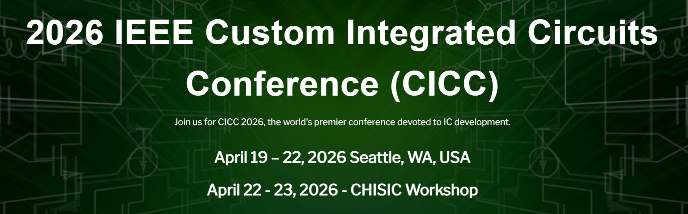
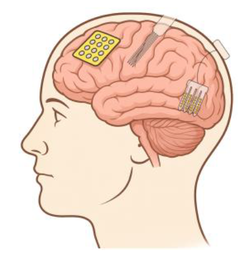

近日，林秋阳博士参与撰写的关于**下一代神经接口电路架构**的综述文章发表于 **IEEE Custom Integrated Circuits Conference（CICC）2026**。

该工作题为 **“Circuit Architectures for Next-Generation Neural Interfaces: Recording, Stimulation, and Closed-Loop Neuromodulation”**，系统综述了面向下一代**脑机接口、神经假体、神经调控与基础神经科学研究**的集成电路架构与关键电路技术。

<!--more-->

该综述围绕现代神经接口系统中的三类核心功能展开：

- **神经信号记录**
- **神经刺激**
- **闭环神经调控**

文章指出，随着神经接口系统向**更高通道数、更高集成度、更低功耗和更小面积**发展，电路设计需要在噪声、功耗、面积、动态范围、输入阻抗以及刺激伪迹耐受能力之间实现更加精细的权衡。

在**神经记录前端电路**方面，文章重点讨论了多种面向高密度神经探针的读出架构，包括：

- 传统 **模拟前端 + 时分复用 ADC** 架构
- **直接数字化前端（Direct-Digitization Front-End, DDFE）**
- 基于**电极复用**的面积压缩架构
- 面向大规模阵列的低噪声、低功耗、高动态范围读出技术

这些架构支撑了从局部场电位（LFP）、皮层脑电（ECoG）到动作电位（AP/spike）等多类神经信号的高保真采集。

在**体外 CMOS 微电极阵列（MEA）**方面，文章总结了多模态 MEA 系统的发展趋势。除高密度电生理记录外，现代 MEA 平台还逐渐集成：

- 细胞电穿孔
- 阻抗谱测量
- 高通量细胞检测
- 三维类器官与复杂神经网络接口

这些技术使 CMOS MEA 不仅能够记录神经元网络活动，还可以用于细胞形态、迁移、黏附、收缩以及非电活性细胞行为的表征。

在**神经刺激与闭环神经调控**方面，文章进一步分析了高压/BCD 工艺下神经刺激器的设计挑战，包括：

- 高顺应电压输出
- 双相刺激波形
- 被动与主动电荷平衡
- 植入式刺激安全性
- 多通道刺激系统的面积与功耗优化

对于闭环神经接口系统，文章强调了**刺激伪迹抑制与快速恢复**的重要性。闭环系统需要在刺激过程中或刺激后快速恢复神经信号记录能力，因此对前端电路的动态范围、共模干扰抑制、自动复位以及伪迹耐受能力提出了更高要求。

该综述进一步总结了近年来**抗刺激伪迹神经记录前端**的发展，从前馈共模抑制、反馈共模消除环路，到多通道共享共模抑制架构，展示了神经接口电路向**高鲁棒性、高密度和闭环实时调控**方向演进的趋势。

这项工作体现了林秋阳在以下方向上的持续积累：

- 脑机接口集成电路
- 高密度神经记录前端
- CMOS 神经探针与微电极阵列
- 神经刺激与闭环神经调控
- 低噪声、低功耗模拟与混合信号电路
- 生物医疗电子系统与智能神经接口

未来，实验室将继续围绕**下一代脑机接口与生物医疗集成电路**开展研究，推动神经记录、神经刺激、闭环调控和多模态生物传感系统在高集成度、高能效和智能化方向上的发展。
