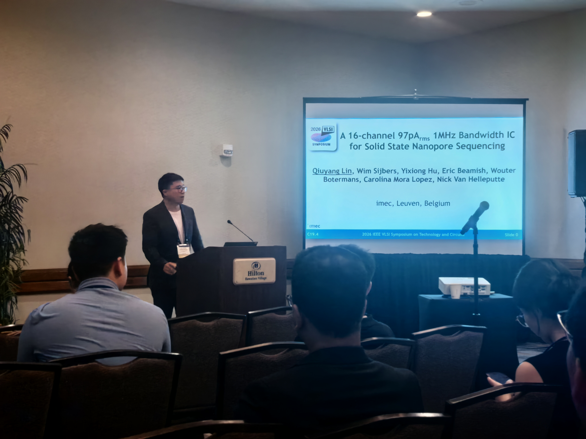

Recently, Dr. Qiuyang Lin delivered an oral presentation at the **2026 IEEE Symposium on VLSI Technology and Circuits**, presenting the team’s latest research progress on **solid-state nanopore sequencing interface chips**.

The work, titled **“A 16-channel 97pArms 1MHz Bandwidth IC for Solid State Nanopore Sequencing”**, targets next-generation **high-throughput, parallelized single-molecule detection and DNA sequencing systems**. It presents a **16-channel fully integrated nanopore interface chip**, achieving a unified design with high gain, wide bandwidth, low noise, and high energy efficiency.

<!--more-->

During the presentation, the audience raised many insightful questions regarding the chip architecture, noise sources, bandwidth extension, equalizer design, and system-level applications. One of the most impressive questions was:

> Why does the equalizer need to provide approximately **16× high-frequency gain**, and why does the noise not become dominant?

In response, Dr. Lin explained that in solid-state nanopore readout systems, the input parasitic capacitance significantly affects the high-frequency response. As a result, fast transient signals can be easily buried by high-frequency noise and front-end bandwidth limitations introduced by the input parasitic capacitance. Therefore, the role of the equalizer is not simply to amplify noise, but rather to compensate for the attenuated high-frequency components of the target signal, enabling effective transient signal detection within a **1MHz bandwidth**.

This presentation highlighted the team’s continuous efforts in the following research directions:

- Solid-state nanopore sequencing interface chips
- Low-noise wide-bandwidth analog front-ends
- High-performance analog and mixed-signal integrated circuits
- Biomedical sensing interface circuits
- High-throughput molecular detection electronics

During the symposium, the team also took a short outdoor trip in Hawaii. The combination of scientific exploration and natural scenery serves as a reminder that cutting-edge chip design requires not only long-term dedication, but also openness, resilience, and curiosity.

Looking ahead, the team will continue to deepen its research in **biomedical integrated circuits, neural interface chips, solid-state nanopore readout chips, and low-noise analog/mixed-signal systems**, advancing high-performance chip design for life science and healthcare applications.

