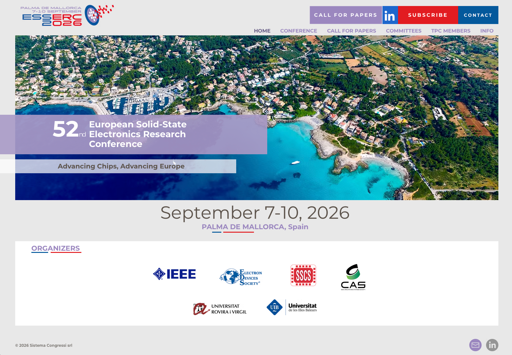
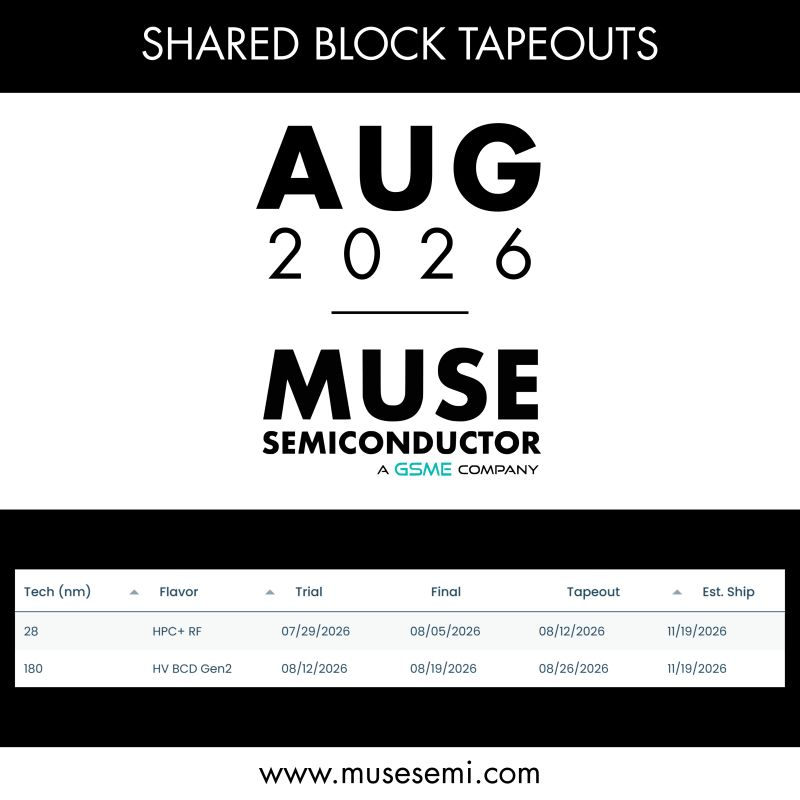
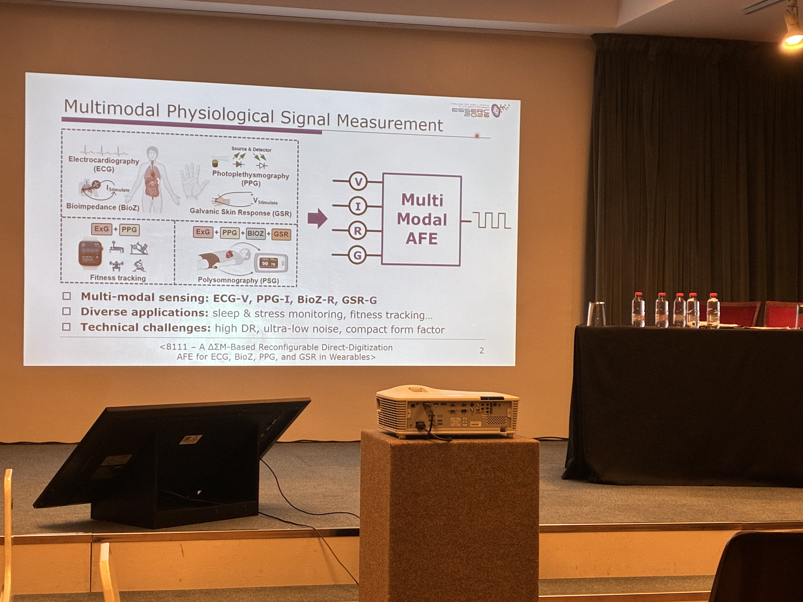
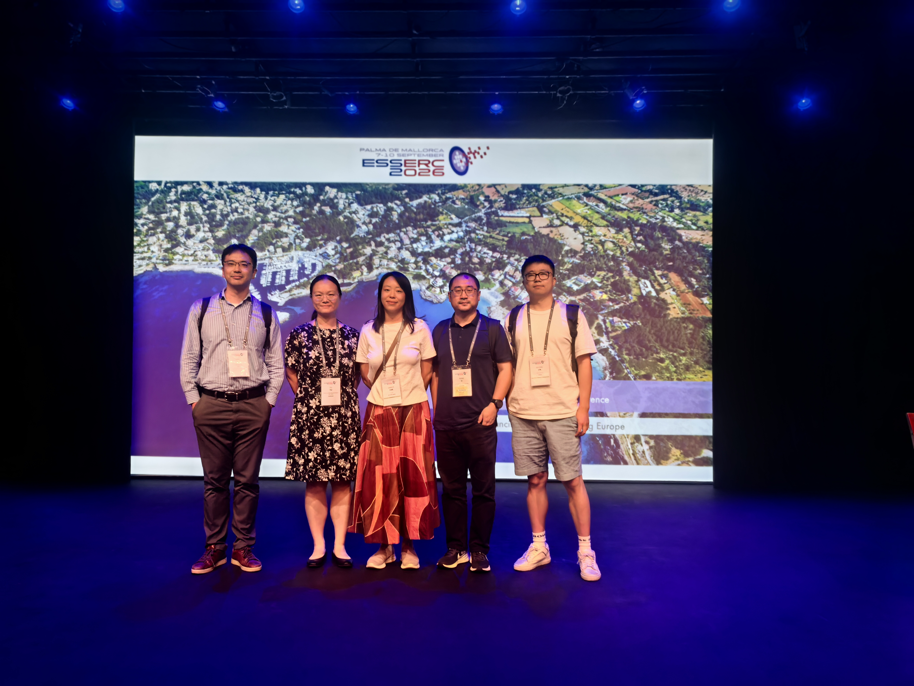

近日，实验室成员赴西班牙帕尔马，参加[第52届欧洲固态电子学研究大会（ESSERC 2026）](https://www.esserc2026.org/)。大会汇集了固态器件、集成电路与系统领域的研究者。对实验室而言，此行既是一次了解前沿工作的机会，也让我们更具体地思考：芯片设计如何回应真实应用中的需求。

<!--more-->

在大会的[机器人传感专题](https://www.esserc2026.org/t3)中，多场报告把芯片与欧洲本土制造业的需求联系起来。英飞凌从人形机器人关节出发，讨论了驱动、控制、力与位置反馈，以及触觉感知等功能的集成；Melexis 则介绍了用于运动控制和灵巧操作的力与力矩传感器。这些工作让我们看到，模拟芯片的价值不只体现在单项性能指标上，也体现在它能否与传感器、机械结构和控制系统共同解决问题。

会议期间，林秋阳还与[Muse Semiconductor](https://www.musesemi.com/)总裁交流，探讨了未来在不同工艺节点开展流片合作，以及设计阶段技术支持、流片服务等议题。这次交流为实验室后续芯片验证寻找了更多可能的路径；具体合作仍有待进一步沟通。

交谈中，半开玩笑地说了一句：“Time is running out.” 对方随即笑着回应，Muse 公司若能配上 Muse 乐队，合作或许会更有“节奏”。这一轻松的插曲，也为围绕时间表与流片支持的认真讨论留下了一个有趣的注脚。

实验室成员还认真听取了复旦大学徐佳伟教授团队关于可穿戴生物医疗传感前端的报告，以及爱丁堡大学姜雄飞、韩蕴韬同学参与的[双向脑机接口芯片工作](https://epapers2.org/esserc2026/ESR/session_view.php?session_id=28)。从多模态生理信号读出，到神经信号记录、刺激伪迹处理与 spike sorting，这些报告围绕实际系统中的困难展开，也为实验室正在关注的生物医疗传感与神经接口方向带来了启发。

会议期间，我们有幸与代尔夫特理工大学 Qinwen Fan 教授、海德堡大学 Zili Yu 教授、汉堡工业大学 Qiang Li 教授、复旦大学徐佳伟教授，以及 imec首席科学家Yang Zhang 博士、北京大学沈林晓教授等前辈和同行交流、合影。面对面的讨论让我们看到，扎实的电路研究往往始于对问题的长期观察，也离不开反复验证和跨领域协作。

行程最后，实验室成员来到海边，远望海天相接之处。此时再想起“书山有路勤为径，学海无涯苦作舟”，感受比以往更真切：值得回答的问题还有很多，做好一项研究也需要耐心和功夫。实验室将向各位前辈与同行学习，继续立足生物医疗传感与模拟混合信号集成电路，踏实做出有意义、经得起验证的工作。

