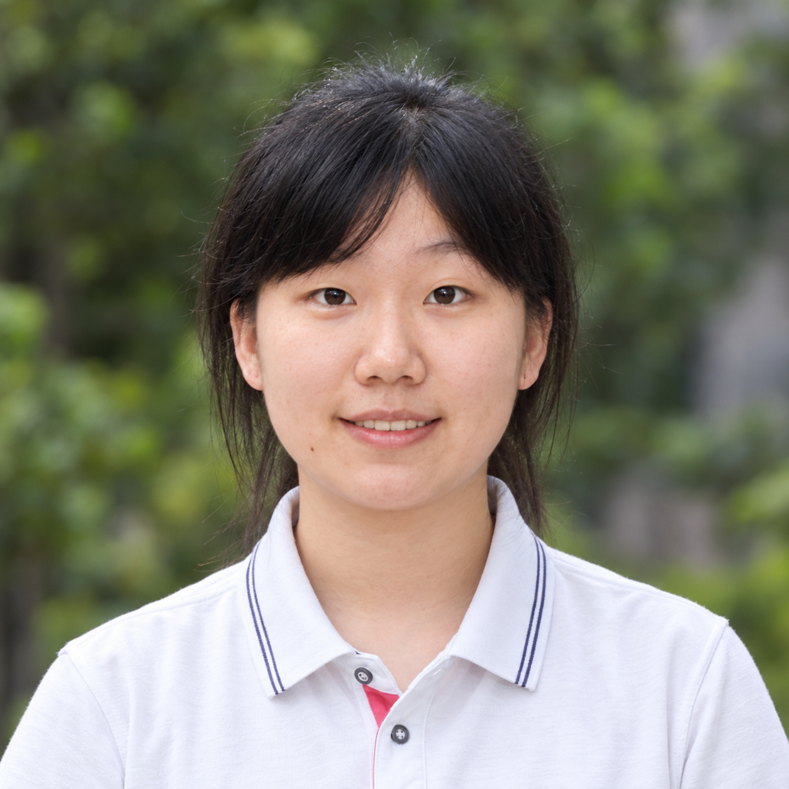
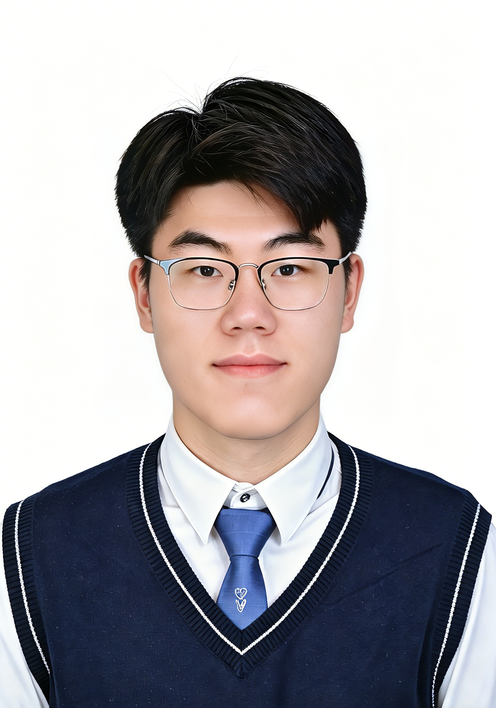

近日，实验室迎来四位新同学——**徐鼎同学**、**劳嘉杰同学**、**刘子宁同学**和**汤珺玉同学**。四位同学均凭借优异的学业成绩获得推免资格，将于 2027 年进入复旦大学芯片与系统前沿技术研究院林秋阳老师课题组继续深造。其中，徐鼎同学和劳嘉杰同学将攻读博士学位，刘子宁同学和汤珺玉同学将攻读硕士学位。

<!--more-->

四位同学分别来自华南理工大学、南京大学、厦门大学和西北工业大学。本科期间，他们不仅保持了优异的学习成绩，也围绕模拟与混合信号集成电路、模拟前端、电源管理、数据转换器、新型存储器和数字硬件设计等方向积累了科研与工程实践经验。

  

    
    
<strong>徐鼎</strong> 博士生（2027–）

    

      徐鼎同学本科就读于华南理工大学微电子科学与工程专业，GPA 为 3.94/4.00，专业排名 3/94。她凭借优异的学业成绩获得推免资格，将于 2027 年进入课题组攻读集成电路科学与工程专业博士学位。
    

    

      本科期间，她围绕低压差线性稳压器开展电路与版图设计，并完成过数字 IC 全流程项目。她的研究兴趣包括模拟与混合信号集成电路、LDO、ADC，以及面向生物医疗应用的电源管理集成电路。
    

  

  

    
    
<strong>劳嘉杰</strong> 博士生（2027–）

    

      劳嘉杰同学本科就读于南京大学集成电路学院集成电路设计与集成系统专业，成绩名列前茅，曾获国家奖学金、校优秀共青团员和校优秀学生干部等荣誉。他以优异成绩获得推免资格，将于 2027 年进入课题组攻读博士学位。
    

    

      本科期间，他曾在清华大学集成电路学院吴华强老师课题组参与 RRAM 与存算一体芯片研究，并开展 Falcon 后量子签名算法硬件加速和两级运算放大器设计。他的研究兴趣包括模拟与混合信号集成电路、生物医疗集成电路、模拟前端和 ADC。
    

  

  

    
    
<strong>刘子宁</strong> 硕士生（2027–）

    

      刘子宁同学本科就读于厦门大学集成电路设计与集成系统专业，GPA 为 3.80/4.00，在推免选拔中位列第一，将于 2027 年进入课题组攻读硕士学位。
    

    

      本科期间，刘子宁同学开展了 FeFET 器件建模与仿真研究，并曾在中国科学院上海技术物理研究所参与运算放大器和 CTIA 电流读出电路设计。研究兴趣包括模拟集成电路、模拟前端与电流读出电路、新型铁电存储器建模及集成电路设计与验证。
    

  

  

    
    
<strong>汤珺玉</strong> 硕士生（2027–）

    

      汤珺玉同学本科就读于西北工业大学集成电路学院集成电路设计与集成系统专业，GPA 为 4.018/4.1，专业排名 1/115。她曾两次获得国家奖学金，并以专业第一名的优异成绩获得推免资格，将于 2027 年进入课题组攻读硕士学位。
    

    

      本科期间，她参与了光电传感器模拟前端芯片设计，完成 SAR ADC、采样开关、动态比较器及两级运算放大器等电路的设计与仿真。她的研究兴趣包括模拟与混合信号集成电路、模拟前端、数据转换器和低功耗运算放大器。
    

  

四位同学的研究经历覆盖了以下方向：

- 模拟与混合信号集成电路
- 生物医疗集成电路与生物信号采集前端
- 模数转换器与低功耗运算放大器
- LDO 与电源管理集成电路
- 新型存储器、存算一体与电流读出电路
- 数字硬件设计与集成电路验证

四位同学凭借优异的学业成绩和综合表现获得推免资格，也体现了课题组在新成员选拔中对专业基础、科研潜力和实践能力的重视。未来，课题组将继续围绕面向生物医疗与智能感知应用的高性能、高集成度芯片与系统开展研究。

欢迎徐鼎、劳嘉杰、刘子宁和汤珺玉四位同学加入课题组，期待大家在未来的学习与科研工作中相互启发、共同成长！
