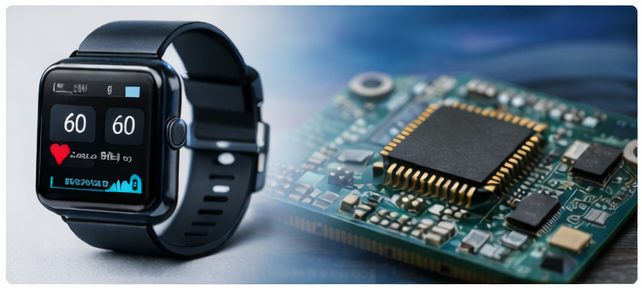
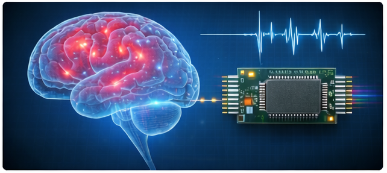
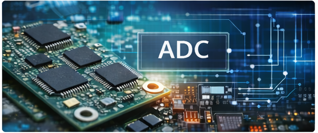
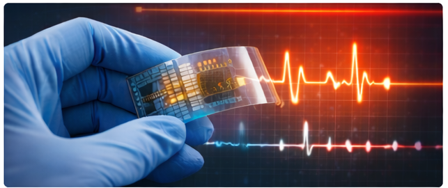

本页面记录实验室在科研过程中阅读的一些论文笔记与思考。

主要方向包括：

- 可穿戴生物医疗芯片  
- 脑机接口芯片  
- 数模转换器芯片  
- 新型生物医疗感知芯片  

---

## 阅读方向

| | |
|---|---|
|  |  |
| **Wearable Biomedical ICs** | **Neural Interface ICs** |
| 可穿戴生物医疗系统与低功耗芯片设计相关论文阅读。 | 脑机接口与神经信号采集芯片相关论文阅读。 |

| | |
|---|---|
|  |  |
| **Data Converter ICs** | **Emerging Sensing ICs** |
| ADC / DAC 以及数据转换器设计相关论文阅读。 | 新型生物传感与新兴生物电子系统相关论文阅读。 |
